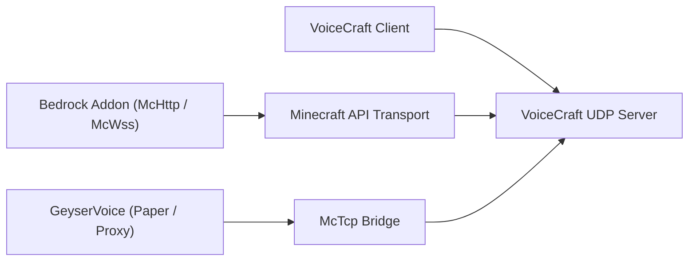

# VoiceCraft-Ökosystem

VoiceCraft ist nicht nur eine Binärdatei. Es handelt sich um ein kleines Ökosystem aus Repositories und Laufzeitschichten, die auf unterschiedliche Weise kombiniert werden können.

Die Grundidee ist einfach: Spieler führen `VoiceCraft.Client` aus, ein Backend führt `VoiceCraft.Server` aus oder verwaltet es und eine Minecraft-seitige Integration sendet den Spielstatus an den Server. Welche Integration Sie wählen, hängt davon ab, ob Ihre Minecraft-Laufzeitumgebung Bedrock, lokales Bedrock, Direct Paper oder ein Proxy-Netzwerk ist.

## Kernrepositorys

| Repository | Was es besitzt | Verwenden Sie es wann |
|------------|--------------|-------------|
| `VoiceCraft` | Client-Apps, eigenständiger Server, Protokoll, gemeinsam genutzter Kerncode, Minecraft-orientierte Transporte | Sie benötigen die Core-Server-/Client-Laufzeit oder möchten aus dem Quellcode erstellen |
| `GeyserVoice` | Java-seitige Brücke für Paper, Velocity und BungeeCord | Sie führen Java, Geyser/Floodgate oder ein Proxy-Netzwerk aus |
| `VoiceCraft.Addon` | Bedrock-Add-on-Pakete und skriptfähige McApi-Oberfläche | Sie führen Bedrock-Welten aus oder möchten ein benutzerdefiniertes Add-on-Verhalten |

## Bereitstellungskarte

Der Client und die Minecraft-Integration stellen keine Verbindung über denselben Pfad her. Der Client verwendet den VoiceCraft UDP-Endpunkt. Die Minecraft-Integration verwendet `McHttp`, `McWss` oder `McTcp`.

## Typische Stapel

### Dedizierter Bedrock-Server

- `VoiceCraft.Server`
- `VoiceCraft.Addon.Core.McHttp`
- VoiceCraft-Kunden
- Vom Add-on benötigte BDS-Skript-/Modulberechtigungen

Verwenden Sie dies für Bedrock-Produktionsserver, auf denen BDS einen HTTP-Endpunkt erreichen kann.

### Lokale Bedrock-Welt

- lokaler VoiceCraft-Stack
- `VoiceCraft.Addon.Core.McWss`
- lokaler `/connect`-Websocket-Fluss

Verwenden Sie dies für Einzelspieler-, Demo- und Add-on-Tests.

### Java-Server mit Geyser / Floodgate

- `GeyserVoice`
- `VoiceCraft.Server`
- optional eine verwaltete Laufzeit, die von `GeyserVoice` selbst gestartet wird
- `McTcp` als VoiceCraft-zugewandte Brücke

Verwenden Sie dies, wenn der Java-seitige Serverstatus die Quelle der Spielerpositionen und des Bindungsflusses ist.

### Java-Proxy-Netzwerk

- `GeyserVoice` auf Proxy
- `GeyserVoice` auf Backend-Paper-Servern
- `VoiceCraft.Server` erreicht über `McTcp`
- Backend-Knoten streamen Snapshots an den Proxy

Verwenden Sie dies, wenn ein Proxy die zentrale VoiceCraft-Verbindung für mehrere Backend-Server besitzen soll.

## Warum es mehrere Repos gibt

- `VoiceCraft` konzentriert sich auf die Kern-Sprachplattform
- `GeyserVoice` übersetzt Java- oder Proxy-Umgebungen in einen VoiceCraft-kompatiblen Zustand
- `VoiceCraft.Addon` stellt Weltautomatisierung, Entity-Bindung und Effektkontrolle auf Bedrock bereit

Durch diese Aufteilung kann sich jedes Projekt rund um seine Laufzeit weiterentwickeln: C#-Client-/Servercode in `VoiceCraft`, Java-Plugin-Code in `GeyserVoice` und Bedrock-Skript-/Add-On-Code in `VoiceCraft.Addon`.

## Wählen Sie, wo Sie beginnen möchten

- Neuer dedizierter Bedrock-Server:
  Beginnen Sie mit [Quick Start](/start/quick-start), dann [McHttp for BDS](/minecraft/mchttp-bds).
- Lokale Bedrock-Tests:
  Beginnen Sie mit [McWss for Singleplayer Worlds](/minecraft/mcwss-singleplayer).
- Java + Geyser/Floodgate:
  Beginnen Sie mit [GeyserVoice](/ecosystem/geyservoice).
- Benutzerdefiniertes Bedrock-Verhalten:
  Lesen Sie [VoiceCraft.Addon](/ecosystem/voicecraft-addon), dann [Addon API](/ecosystem/addon-api).

## Weiter mit

- [VoiceCraft repository and build](/ecosystem/voicecraft-repository)
- [GeyserVoice overview](/ecosystem/geyservoice)
- [VoiceCraft.Addon overview](/ecosystem/voicecraft-addon)
- [Addon API](/ecosystem/addon-api)
- [Integration recipes](/ecosystem/integration-recipes)
- [Production blueprints](/ecosystem/production-blueprints)
