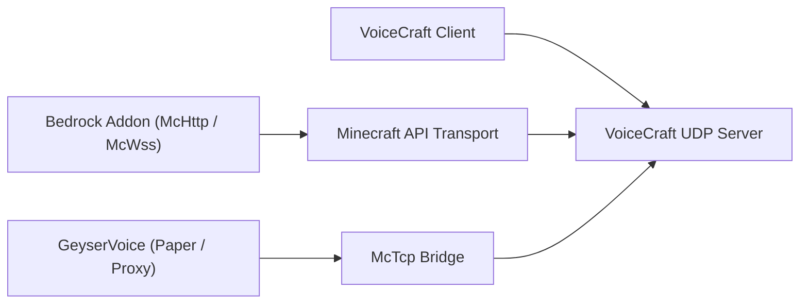

# VoiceCraft-Ökosystem

VoiceCraft ist nicht nur eine Binärdatei. Es handelt sich um ein kleines Ökosystem aus Repositories und Laufzeitschichten, die auf unterschiedliche Weise kombiniert werden können.

## Kernrepositorys

1. `VoiceCraft`
   Client-Apps, eigenständiger Server, Protokoll, gemeinsam genutzter Kerncode
2. `GeyserVoice`
   Java-seitige Brücke für Paper, Velocity und BungeeCord
3. `VoiceCraft.Addon`
   Bedrock-Add-on-Pakete und skriptfähige McApi-Oberfläche

## Bereitstellungskarte

## Typische Stapel

### Dedizierter Bedrock-Server

- `VoiceCraft.Server`
- `VoiceCraft.Addon.Core.McHttp`
- VoiceCraft-Kunden

### Lokale Grundgesteinswelt

- lokaler VoiceCraft-Stack
- `VoiceCraft.Addon.Core.McWss`

### Java-Server mit Geyser / Floodgate

- `GeyserVoice`
- `VoiceCraft.Server`
- optionally a managed runtime started by `GeyserVoice` itself

### Java-Proxy-Netzwerk

- `GeyserVoice` on proxy
- `GeyserVoice` on backend Paper servers
- `VoiceCraft.Server` reached through `McTcp`

## Warum mehrere Repos existieren

- `VoiceCraft` focuses on the core voice platform
- `GeyserVoice` translates Java or proxy environments into VoiceCraft-compatible state
- `VoiceCraft.Addon` exposes world automation, entity binding, and effect control on Bedrock

## Weiter mit

- [VoiceCraft-Repository und Build](/ecosystem/voicecraft-repository)
- [GeyserVoice-Übersicht](/ecosystem/geyservoice)
- [VoiceCraft.Addon-Übersicht](/ecosystem/voicecraft-addon)
- [Add-on-API](/ecosystem/addon-api)
- [Integrationsrezepte](/ecosystem/integration-recipes)
- [Produktionspläne](/ecosystem/production-blueprints)
