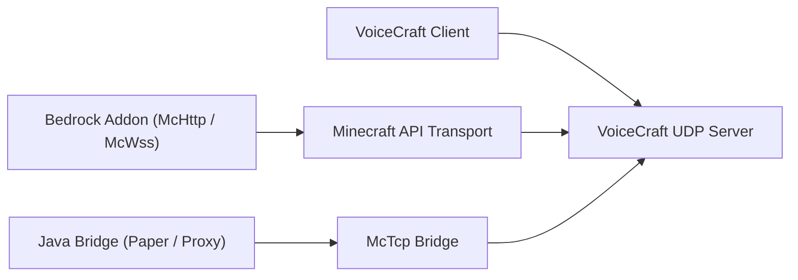

# Экосистема VoiceCraft

VoiceCraft — это не один бинарник, а набор runtime layers и репозиториев, которые комбинируются под разные Minecraft-топологии.

Идея простая: игроки запускают `VoiceCraft.Client`, backend запускает или управляет `VoiceCraft.Server`, а Minecraft-side integration отправляет game state в сервер. Выбор integration зависит от того, Bedrock это, local Bedrock, direct Paper или proxy network.

## Core repositories

| Repository | За что отвечает | Когда нужен |
|------------|-----------------|-------------|
| `VoiceCraft` | client apps, standalone server, protocol, shared core code, Minecraft-facing transports | нужен core server/client runtime или сборка из source |
| `GeyserVoice` / Java bridge | Java-side bridge для Paper, Velocity, BungeeCord | Java, Geyser/Floodgate или proxy network |
| `VoiceCraft.Addon` | Bedrock addon packages и scriptable McApi surface | Bedrock worlds или custom addon behavior |

Primary source repository для core VoiceCraft development — GitLab project. GitHub repository используется как public mirror и release distribution point.

## Что добавляет 1.7

VoiceCraft `1.7.0` в основном меняет core runtime и protocol:

- event subscriptions и event packet wrapping переработаны
- entity custom properties стали extension point для effect overrides
- audio effect stack переписан вокруг processors
- NAT port mapping доступен для server/transports
- iOS packaging получил privacy manifest и local-network permission text
- browser/web client target удалён

Stock integrations обычно требуют matching releases. Custom integrations должны проверить 1.7 packet/property model.

## Deployment map

Client и Minecraft integration не используют один и тот же путь. Client подключается к VoiceCraft UDP endpoint. Minecraft integration использует `McHttp`, `McWss` или `McTcp`.

## Типичные стеки

### Bedrock Dedicated Server

- `VoiceCraft.Server`
- `VoiceCraft.Addon.Core.McHttp`
- VoiceCraft clients
- BDS script/module permissions для addon

Используйте для production Bedrock servers, где BDS может достучаться до HTTP endpoint.

### Local Bedrock world

- local VoiceCraft stack
- `VoiceCraft.Addon.Core.McWss`
- local `/connect` websocket flow

Используйте для singleplayer, demos и addon testing.

### Java server with Geyser / Floodgate

- Java-side VoiceCraft bridge
- `VoiceCraft.Server`
- возможно managed runtime, стартующий из bridge
- `McTcp` как VoiceCraft-facing bridge

Используйте, когда Java-side state является источником positions и bind flow.

### Java proxy network

- bridge plugin на proxy
- bridge plugin на backend Paper servers
- `VoiceCraft.Server` через `McTcp`
- backend nodes отправляют snapshots на proxy

Используйте, когда один proxy должен владеть центральным VoiceCraft connection для нескольких backend servers.

## С чего начать

- Новый Bedrock Dedicated Server:
  [Quick Start](/start/quick-start), затем [McHttp для BDS](/minecraft/mchttp-bds).
- Local Bedrock testing:
  [McWss для Singleplayer Worlds](/minecraft/mcwss-singleplayer).
- Java + Geyser/Floodgate:
  [GeyserVoice](/ecosystem/geyservoice).
- Custom Bedrock behavior:
  [VoiceCraft.Addon](/ecosystem/voicecraft-addon), затем [Addon API](/ecosystem/addon-api).

## Читать дальше

- [VoiceCraft repository and build](/ecosystem/voicecraft-repository)
- [GeyserVoice overview](/ecosystem/geyservoice)
- [VoiceCraft.Addon overview](/ecosystem/voicecraft-addon)
- [Addon API](/ecosystem/addon-api)
- [Integration recipes](/ecosystem/integration-recipes)
- [Production blueprints](/ecosystem/production-blueprints)
