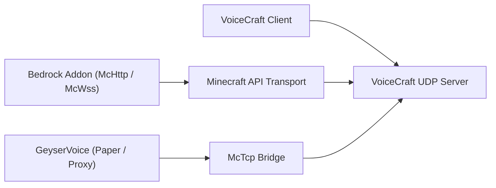

# VoiceCraft Ecosystem

VoiceCraft is not just one binary. It is a small ecosystem of repositories and runtime layers that can be combined in different ways.

## Core repositories

1. `VoiceCraft`
   client apps, standalone server, protocol, shared core code
2. `GeyserVoice`
   Java-side bridge for Paper, Velocity, and BungeeCord
3. `VoiceCraft.Addon`
   Bedrock addon packages and scriptable McApi surface

## Deployment map

## Typical stacks

### Bedrock Dedicated Server

- `VoiceCraft.Server`
- `VoiceCraft.Addon.Core.McHttp`
- VoiceCraft clients

### Local Bedrock world

- local VoiceCraft stack
- `VoiceCraft.Addon.Core.McWss`

### Java server with Geyser / Floodgate

- `GeyserVoice`
- `VoiceCraft.Server`
- optionally a managed runtime started by `GeyserVoice` itself

### Java proxy network

- `GeyserVoice` on proxy
- `GeyserVoice` on backend Paper servers
- `VoiceCraft.Server` reached through `McTcp`

## Why multiple repos exist

- `VoiceCraft` focuses on the core voice platform
- `GeyserVoice` translates Java or proxy environments into VoiceCraft-compatible state
- `VoiceCraft.Addon` exposes world automation, entity binding, and effect control on Bedrock

## Continue with

- [VoiceCraft repository and build](/en/ecosystem/voicecraft-repository)
- [GeyserVoice overview](/en/ecosystem/geyservoice)
- [VoiceCraft.Addon overview](/en/ecosystem/voicecraft-addon)
- [Addon API](/en/ecosystem/addon-api)
- [Integration recipes](/en/ecosystem/integration-recipes)
- [Production blueprints](/en/ecosystem/production-blueprints)
