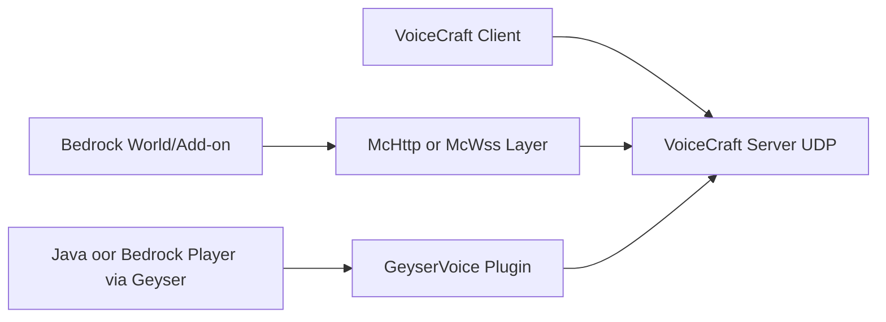

# VoiceCraft Ecosystem

This section documents the 3 repositories that are usually deployed together:

1. `VoiceCraft` — core stack (client + server + protocol + Bedrock integration).
2. `GeyserVoice` — Java plugin for Paper/Velocity/Bungeecord, bridge between Java/Geyser and VoiceCraft.
3. `VoiceCraft.Addon` — Bedrock addon (Basic/McHttp/McWss) for world-to-VoiceCraft API integration.

## When to use what

- Bedrock Dedicated Server: usually `VoiceCraft.Server` + `VoiceCraft.Addon.Core.McHttp`.
- Singleplayer Bedrock world: `VoiceCraft` client + `Core.McWss` package.
- Java server with Geyser/Floodgate: `GeyserVoice` on Paper server.
- Java network with Geyser/Floodgate: `GeyserVoice` on proxy (Velocity/Bungee) + `GeyserVoice` on Paper (proxy mode).

## Quick interaction map

## Continue with

- [VoiceCraft (repository and build)](/en/ecosystem/voicecraft-repository)
- [GeyserVoice (Java/Geyser)](/en/ecosystem/geyservoice)
- [VoiceCraft.Addon (Bedrock Addon)](/en/ecosystem/voicecraft-addon)
- [Integration recipes](/en/ecosystem/integration-recipes)
