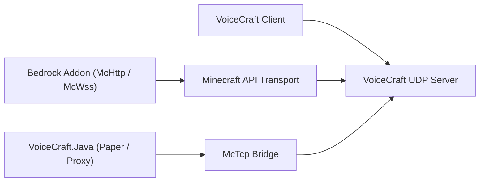

# VoiceCraft Ecosystem

VoiceCraft is not just one binary. It is a small ecosystem of repositories and runtime layers that can be combined in different ways.

The main idea is simple: players run `VoiceCraft.Client`, one backend runs or manages `VoiceCraft.Server`, and a Minecraft-side integration sends game state into the server. Which integration you choose depends on whether your Minecraft runtime is Bedrock, local Bedrock, direct Paper, or a proxy network.

## Core repositories

| Repository | What it owns | Use it when |
|------------|--------------|-------------|
| `VoiceCraft` | client apps, standalone server, protocol, shared core code, Minecraft-facing transports | you need the core server/client runtime or want to build from source |
| `VoiceCraft.Java` | Java-side bridge for Paper, Velocity, and BungeeCord | you run Java, Geyser/Floodgate, or a proxy network |
| `VoiceCraft.Addon` | Bedrock addon packages and scriptable McApi surface | you run Bedrock worlds or want custom addon behavior |

## Deployment map

The client and Minecraft integration do not connect through the same path. The client uses the VoiceCraft UDP endpoint. The Minecraft integration uses `McHttp`, `McWss`, or `McTcp`.

## Typical stacks

### Bedrock Dedicated Server

- `VoiceCraft.Server`
- `VoiceCraft.Addon.Core.McHttp`
- VoiceCraft clients
- BDS script/module permissions needed by the addon

Use this for production Bedrock servers where BDS can reach an HTTP endpoint.

### Local Bedrock world

- local VoiceCraft stack
- `VoiceCraft.Addon.Core.McWss`
- local `/connect` websocket flow

Use this for singleplayer, demos, and addon testing.

### Java server with Geyser / Floodgate

- `VoiceCraft.Java`
- `VoiceCraft.Server`
- optionally a managed runtime started by `VoiceCraft.Java` itself
- `McTcp` as the VoiceCraft-facing bridge

Use this when Java-side server state is the source of player positions and bind flow.

### Java proxy network

- `VoiceCraft.Java` on proxy
- `VoiceCraft.Java` on backend Paper servers
- `VoiceCraft.Server` reached through `McTcp`
- backend nodes stream snapshots to the proxy

Use this when one proxy should own the central VoiceCraft connection for multiple backend servers.

## Why multiple repos exist

- `VoiceCraft` focuses on the core voice platform
- `VoiceCraft.Java` translates Java or proxy environments into VoiceCraft-compatible state
- `VoiceCraft.Addon` exposes world automation, entity binding, and effect control on Bedrock

This split lets each project evolve around its runtime: C# client/server code in `VoiceCraft`, Java plugin code in `VoiceCraft.Java`, and Bedrock script/addon code in `VoiceCraft.Addon`.

## Choosing where to start

- New Bedrock Dedicated Server:
  start with [Quick Start](/start/quick-start), then [McHttp for BDS](/minecraft/mchttp-bds).
- Local Bedrock testing:
  start with [McWss for Singleplayer Worlds](/minecraft/mcwss-singleplayer).
- Java + Geyser/Floodgate:
  start with [VoiceCraft.Java](/ecosystem/voicecraft-java).
- Custom Bedrock behavior:
  read [VoiceCraft.Addon](/ecosystem/voicecraft-addon), then [Addon API](/ecosystem/addon-api).

## Continue with

- [VoiceCraft repository and build](/ecosystem/voicecraft-repository)
- [VoiceCraft.Java overview](/ecosystem/voicecraft-java)
- [VoiceCraft.Addon overview](/ecosystem/voicecraft-addon)
- [Addon API](/ecosystem/addon-api)
- [Integration recipes](/ecosystem/integration-recipes)
- [Production blueprints](/ecosystem/production-blueprints)
