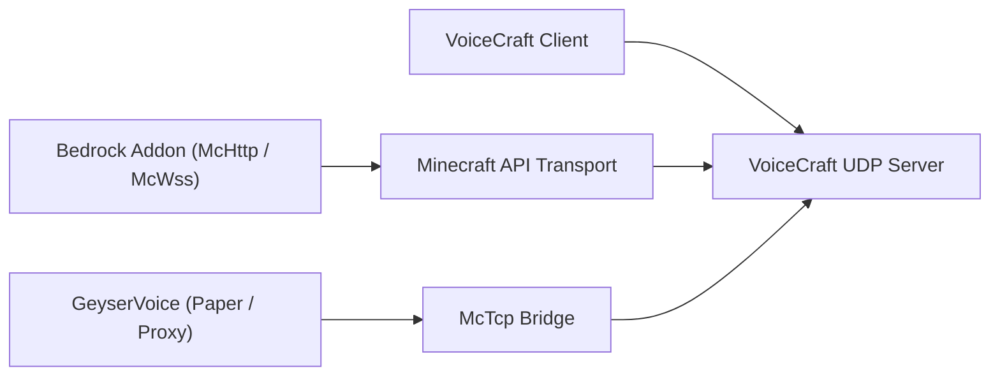

# VoiceCraft-ecosysteem

VoiceCraft is niet slechts één binair bestand. Het is een klein ecosysteem van repositories en runtime-lagen die op verschillende manieren kunnen worden gecombineerd.

## Kernrepositories

1. `VoiceCraft`
   client-apps, zelfstandige server, protocol, gedeelde kerncode
2. `GeyserVoice`
   Java-zijbrug voor Paper, Velocity en BungeeCord
3. `VoiceCraft.Addon`
   Basis add-onpakketten en scriptbaar McApi-oppervlak

## Implementatiekaart

## Typische stapels

### Bedrock speciale server

- `VoiceCraft.Server`
- `VoiceCraft.Addon.Core.McHttp`
- VoiceCraft-clients

### Lokale gesteentewereld

- lokale VoiceCraft-stack
- `VoiceCraft.Addon.Core.McWss`

### Java-server met Geyser / Floodgate

- `GeyserVoice`
- `VoiceCraft.Server`
- optionally a managed runtime started by `GeyserVoice` itself

### Java-proxynetwerk

- `GeyserVoice` on proxy
- `GeyserVoice` on backend Paper servers
- `VoiceCraft.Server` reached through `McTcp`

## Waarom er meerdere repo's bestaan

- `VoiceCraft` focuses on the core voice platform
- `GeyserVoice` translates Java or proxy environments into VoiceCraft-compatible state
- `VoiceCraft.Addon` exposes world automation, entity binding, and effect control on Bedrock

## Ga verder met

- [VoiceCraft-repository en build] (/ecosystem/voicecraft-repository)
- [GeyserVoice-overzicht](/ecosystem/geyservoice)
- [VoiceCraft.Addon-overzicht] (/ecosystem/voicecraft-addon)
- [Add-on-API](/ecosystem/addon-api)
- [Integratierecepten](/ecosystem/integration-recipes)
- [Productieblauwdrukken] (/ecosystem/production-blueprints)
