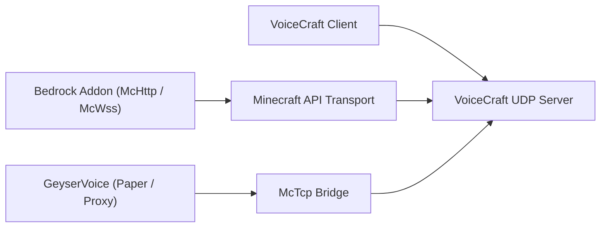

# Ekosystem VoiceCraft

VoiceCraft to nie tylko jeden plik binarny. Jest to mały ekosystem repozytoriów i warstw wykonawczych, które można łączyć na różne sposoby.

## Podstawowe repozytoria

1. `VoiceCraft`
   aplikacje klienckie, samodzielny serwer, protokół, współdzielony kod podstawowy
2. `GeyserVoice`
   Mostek po stronie Java dla Paper, Velocity i BungeeCord
3. `VoiceCraft.Addon`
   Pakiety dodatków Bedrock i skryptowalna powierzchnia McApi

## Mapa rozmieszczenia

## Typowe stosy

### Serwer dedykowany Bedrock

- `VoiceCraft.Server`
- `VoiceCraft.Addon.Core.McHttp`
- Klienci VoiceCraft

### Lokalny świat Bedrock

- lokalny stos VoiceCraft
- `VoiceCraft.Addon.Core.McWss`

### Serwer Java z Geyserem/Floodgate

- `GeyserVoice`
- `VoiceCraft.Server`
- optionally a managed runtime started by `GeyserVoice` itself

### Sieć proxy Java

- `GeyserVoice` on proxy
- `GeyserVoice` on backend Paper servers
- `VoiceCraft.Server` reached through `McTcp`

## Dlaczego istnieje wiele repozytoriów

- `VoiceCraft` focuses on the core voice platform
- `GeyserVoice` translates Java or proxy environments into VoiceCraft-compatible state
- `VoiceCraft.Addon` exposes world automation, entity binding, and effect control on Bedrock

## Kontynuuj

- [Repozytorium i kompilacja VoiceCraft](/ecosystem/voicecraft-repository)
- [Przegląd GeyserVoice](/ecosystem/geyservoice)
- [Przegląd dodatku VoiceCraft.Dodatek](/ecosystem/voicecraft-addon)
- [API dodatku](/ecosystem/addon-api)
- [Przepisy integracyjne](/ecosystem/integration-recipes)
- [Plany produkcyjne](/ecosystem/production-blueprints)
