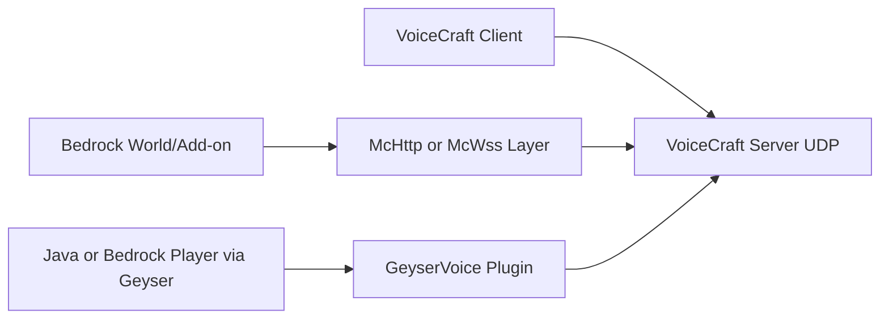

# Экосистема VoiceCraft

Этот раздел покрывает 3 репозитория, которые обычно разворачиваются вместе:

1. `VoiceCraft` — основной стек (клиент + сервер + протокол + Bedrock-интеграция).
2. `GeyserVoice` — Java-плагин для Paper/Velocity/Bungeecord, мост между Java/Geyser и VoiceCraft.
3. `VoiceCraft.Addon` — Bedrock аддон (Basic/McHttp/McWss) для интеграции мира с VoiceCraft API.

## Где что использовать

- Если у вас Bedrock Dedicated Server: чаще всего `VoiceCraft.Server` + `VoiceCraft.Addon.Core.McHttp`.
- Если у вас одиночный Bedrock мир: `VoiceCraft` клиент + `Core.McWss` пакет.
- Если у вас Java сервер с Geyser/Floodgate: `GeyserVoice` на Paper сервере.
- Если у вас Java сеть с Geyser/Floodgate: `GeyserVoice` на proxy (Velocity/Bungee) + `GeyserVoice` на Paper (с proxy-режимом).

## Быстрая карта взаимодействия

Если вы делаете свой аддон/обвязку, ориентируйтесь на эту версию протокольного слоя.

## Что дальше читать

- [VoiceCraft (репозиторий и сборка)](/ru/ecosystem/voicecraft-repository)
- [GeyserVoice (Java/Geyser)](/ru/ecosystem/geyservoice)
- [VoiceCraft.Addon (Bedrock Addon)](/ru/ecosystem/voicecraft-addon)
- [Готовые сценарии интеграции](/ru/ecosystem/integration-recipes)
