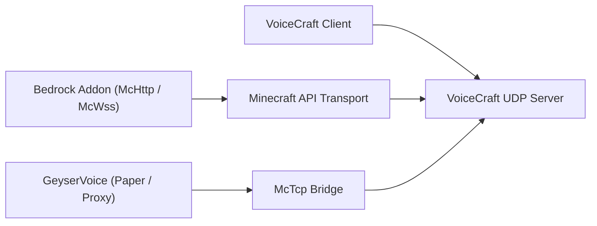

# Экосистема VoiceCraft

VoiceCraft это не один бинарник, а небольшой набор репозиториев и runtime-слоёв, которые можно комбинировать в разных сценариях.

## Основные репозитории

1. `VoiceCraft`
   клиентские приложения, standalone server, протокол, shared code
2. `GeyserVoice`
   Java-side bridge для Paper, Velocity и BungeeCord
3. `VoiceCraft.Addon`
   Bedrock addon packages и scriptable McApi surface

## Карта развёртывания

## Типичные стеки

### Bedrock Dedicated Server

- `VoiceCraft.Server`
- `VoiceCraft.Addon.Core.McHttp`
- VoiceCraft clients

### Локальный Bedrock мир

- локальный VoiceCraft stack
- `VoiceCraft.Addon.Core.McWss`

### Java-сервер с Geyser / Floodgate

- `GeyserVoice`
- `VoiceCraft.Server`
- или managed runtime, который запускается самим `GeyserVoice`

### Java proxy network

- `GeyserVoice` на proxy
- `GeyserVoice` на backend Paper серверах
- `VoiceCraft.Server` через `McTcp`

## Что читать дальше

- [VoiceCraft (репозиторий и сборка)](/ru/ecosystem/voicecraft-repository)
- [GeyserVoice](/ru/ecosystem/geyservoice)
- [VoiceCraft.Addon](/ru/ecosystem/voicecraft-addon)
- [Addon API](/ru/ecosystem/addon-api)
- [Готовые сценарии интеграции](/ru/ecosystem/integration-recipes)
- [Production blueprints](/ru/ecosystem/production-blueprints)
