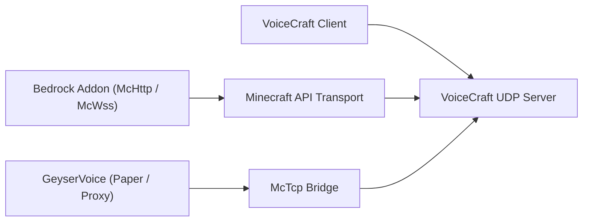

# Экосистема VoiceCraft

VoiceCraft — это не просто один двоичный файл. Это небольшая экосистема репозиториев и слоев среды выполнения, которые можно комбинировать по-разному.

Основная идея проста: игроки запускают `VoiceCraft.Client`, один бэкэнд запускает или управляет `VoiceCraft.Server`, а интеграция со стороны Minecraft отправляет состояние игры на сервер. Какую интеграцию вы выберете, зависит от того, является ли ваша среда выполнения Minecraft Bedrock, локальной Bedrock, Direct Paper или прокси-сетью.

## Основные репозитории

| Репозиторий | Чем он владеет | Используйте его, когда |
|------------|--------------|-------------|
| `VoiceCraft` | клиентские приложения, автономный сервер, протокол, общий основной код, транспорты для Minecraft | вам нужна среда выполнения основного сервера/клиента или вы хотите выполнить сборку из исходного кода |
| `GeyserVoice` | Java-мост для Paper, Velocity и BungeeCord | вы используете Java, Geyser/Floodgate или прокси-сеть |
| `VoiceCraft.Addon` | Пакеты дополнений Bedrock и поверхность McApi с поддержкой сценариев. | вы используете миры Bedrock или хотите настроить поведение аддона |

## Карта развертывания

Интеграция клиента и Minecraft не осуществляется по одному и тому же пути. Клиент использует конечную точку VoiceCraft UDP. Интеграция Minecraft использует `McHttp`, `McWss` или `McTcp`.

## Типичные стеки

### Выделенный сервер Bedrock

- `VoiceCraft.Server`
- `VoiceCraft.Addon.Core.McHttp`
- Клиенты VoiceCraft
- Разрешения сценария/модуля BDS, необходимые для дополнения

Используйте это для производственных серверов Bedrock, где BDS может достичь конечной точки HTTP.

### Локальный мир Bedrock

- локальный стек VoiceCraft
- `VoiceCraft.Addon.Core.McWss`
- локальный поток веб-сокета `/connect`

Используйте это для одиночной игры, демоверсий и тестирования дополнений.

### Java-сервер с Geyser/Floodgate

- `GeyserVoice`
- `VoiceCraft.Server`
- опционально управляемая среда выполнения, запускаемая самим `GeyserVoice`
- `McTcp` как мост, обращенный к VoiceCraft

Используйте это, когда состояние сервера на стороне Java является источником позиций игроков и потока привязки.

### Прокси-сеть Java

- `GeyserVoice` на прокси
- `GeyserVoice` на внутренних серверах Paper
- `VoiceCraft.Server` достигнут через `McTcp`
- серверные узлы передают снимки на прокси

Используйте это, когда один прокси-сервер должен владеть центральным соединением VoiceCraft для нескольких внутренних серверов.

## Почему существует несколько репозиториев

- `VoiceCraft` фокусируется на базовой голосовой платформе.
- `GeyserVoice` переводит среды Java или прокси в состояние, совместимое с VoiceCraft.
- `VoiceCraft.Addon` предоставляет автоматизацию мира, привязку сущностей и управление эффектами в Bedrock.

Такое разделение позволяет каждому проекту развиваться в зависимости от его среды выполнения: код клиента/сервера C# в `VoiceCraft`, код плагина Java в `GeyserVoice` и код сценария/дополнения Bedrock в `VoiceCraft.Addon`.

## Выбор, с чего начать

- Новый выделенный сервер Bedrock:
  начните с [Quick Start](/start/quick-start), затем [McHttp for BDS](/minecraft/mchttp-bds).
- Локальное тестирование Bedrock:
  начните с [McWss for Singleplayer Worlds](/minecraft/mcwss-singleplayer).
- Ява + Гейзер/Фладгейт:
  начните с [GeyserVoice](/ecosystem/geyservoice).
- Пользовательское поведение Bedrock:
  прочитайте [VoiceCraft.Addon](/ecosystem/voicecraft-addon), затем [Addon API](/ecosystem/addon-api).

## Продолжить с

- [VoiceCraft repository and build](/ecosystem/voicecraft-repository)
- [GeyserVoice overview](/ecosystem/geyservoice)
- [VoiceCraft.Addon overview](/ecosystem/voicecraft-addon)
- [Addon API](/ecosystem/addon-api)
- [Integration recipes](/ecosystem/integration-recipes)
- [Production blueprints](/ecosystem/production-blueprints)
