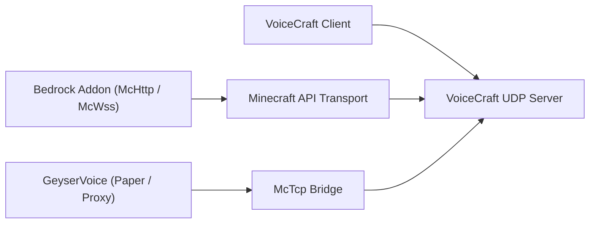

# VoiceCraft 生态系统

VoiceCraft 不仅仅是一种二进制程序。它是一个由仓库和运行时层组成的小型生态系统，可以以不同的方式组合。

## 核心仓库

1. `VoiceCraft`
   客户端应用程序、独立服务器、协议、共享核心代码
2. `GeyserVoice`
   用于 Paper、Velocity 和 BungeeCord 的 Java 端桥
3. `VoiceCraft.Addon`
   Bedrock 插件包和可编写脚本的 McApi 界面

## 部署图

## 典型堆栈

### 基岩专用服务器

- `VoiceCraft.Server`
- `VoiceCraft.Addon.Core.McHttp`
- VoiceCraft 客户端

### 本地基岩世界

- 本地 VoiceCraft 堆栈
- `VoiceCraft.Addon.Core.McWss`

### 带有 Geyser / Floodgate 的 Java 服务器

- `GeyserVoice`
- `VoiceCraft.Server`
- optionally a managed runtime started by `GeyserVoice` itself

### Java代理网络

- `GeyserVoice` on proxy
- `GeyserVoice` on backend Paper servers
- `VoiceCraft.Server` reached through `McTcp`

## 为什么存在多个仓库

- `VoiceCraft` focuses on the core voice platform
- `GeyserVoice` translates Java or proxy environments into VoiceCraft-compatible state
- `VoiceCraft.Addon` exposes world automation, entity binding, and effect control on Bedrock

## 继续

- [VoiceCraft 仓库和构建](/ecosystem/voicecraft-repository)
- [GeyserVoice 概述](/ecosystem/geyservoice)
- [VoiceCraft.Addon 概述](/ecosystem/voicecraft-addon)
- [插件 API](/ecosystem/addon-api)
- [集成方案](/ecosystem/integration-recipes)
- [生产蓝图](/ecosystem/production-blueprints)
