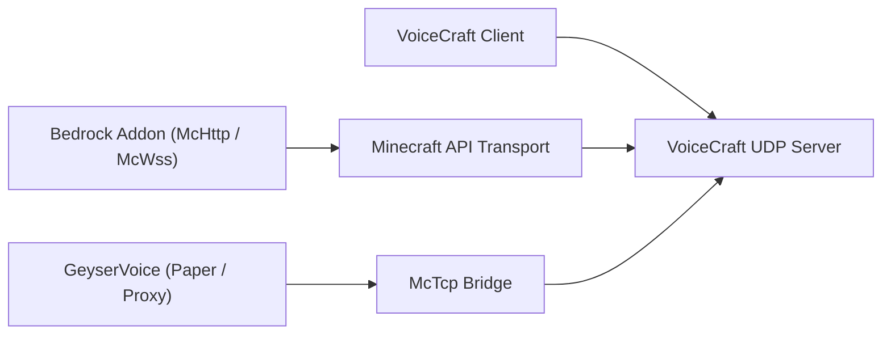

# VoiceCraft 生态系统

VoiceCraft 不仅仅是一种二进制文件。它是一个由存储库和运行时层组成的小型生态系统，可以以不同的方式组合。

主要思想很简单：玩家运行 `VoiceCraft.Client`，一个后端运行或管理 `VoiceCraft.Server`，Minecraft 端集成将游戏状态发送到服务器。您选择哪种集成取决于您的 Minecraft 运行时是 Bedrock、本地 Bedrock、直接 Paper 还是代理网络。

## 核心存储库

| 存储库 | 它拥有什么 | 当 |
|------------|--------------|-------------|
| `VoiceCraft` | 客户端应用程序、独立服务器、协议、共享核心代码、面向 Minecraft 的传输 | 您需要核心服务器/客户端运行时或想要从源代码构建 |
| `GeyserVoice` | 用于 Paper、Velocity 和 BungeeCord 的 Java 端桥 | 您运行 Java、Geyser/Floodgate 或代理网络 |
| `VoiceCraft.Addon` | Bedrock 插件包和可编写脚本的 McApi 界面 | 您运行基岩世界或想要自定义插件行为 |

## 部署图

客户端和 Minecraft 集成不通过同一路径连接。客户端使用 VoiceCraft UDP 端点。 Minecraft 集成使用 `McHttp`、`McWss` 或 `McTcp`。

## 典型堆栈

### 基岩专用服务器

- `VoiceCraft.Server`
- `VoiceCraft.Addon.Core.McHttp`
- VoiceCraft 客户端
- 插件所需的 BDS 脚本/模块权限

将此用于 BDS 可以到达 HTTP 端点的生产 Bedrock 服务器。

### 当地基岩世界

- 本地 VoiceCraft 堆栈
- `VoiceCraft.Addon.Core.McWss`
- 本地 `/connect` websocket 流

使用它进行单人游戏、演示和插件测试。

### 带有 Geyser / Floodgate 的 Java 服务器

- `GeyserVoice`
- `VoiceCraft.Server`
- 可选地，由 `GeyserVoice` 本身启动的托管运行时
- `McTcp` 作为面向 VoiceCraft 的桥

当 Java 端服务器状态是玩家位置和绑定流的来源时使用此选项。

### Java代理网络

- 代理上的 `GeyserVoice`
- 后端 Paper 服务器上的 `GeyserVoice`
- 通过 `McTcp` 到达 `VoiceCraft.Server`
- 后端节点将快照流式传输到代理

当一个代理应该拥有多个后端服务器的中央 VoiceCraft 连接时，请使用此选项。

## 为什么存在多个存储库

- `VoiceCraft`专注于核心语音平台
- `GeyserVoice` 将 Java 或代理环境转换为 VoiceCraft 兼容状态
- `VoiceCraft.Addon` 在基岩上公开世界自动化、实体绑定和效果控制

这种拆分让每个项目都围绕其运行时发展：C# 客户端/服务器代码在 `VoiceCraft` 中，Java 插件代码在 `GeyserVoice` 中，基岩脚本/插件代码在 `VoiceCraft.Addon` 中。

## 选择从哪里开始

- 新基岩专用服务器：
  从 [Quick Start](/start/quick-start) 开始，然后是 [McHttp for BDS](/minecraft/mchttp-bds)。
- 当地基岩测试：
  以 [McWss for Singleplayer Worlds](/minecraft/mcwss-singleplayer) 开头。
- Java + Geyser/Floodgate：
  以 [GeyserVoice](/ecosystem/geyservoice) 开头。
- 自定义基岩行为：
  读取 [VoiceCraft.Addon](/ecosystem/voicecraft-addon)，然后读取 [Addon API](/ecosystem/addon-api)。

## 继续

- [VoiceCraft repository and build](/ecosystem/voicecraft-repository)
- [GeyserVoice overview](/ecosystem/geyservoice)
- [VoiceCraft.Addon overview](/ecosystem/voicecraft-addon)
- [Addon API](/ecosystem/addon-api)
- [Integration recipes](/ecosystem/integration-recipes)
- [Production blueprints](/ecosystem/production-blueprints)
