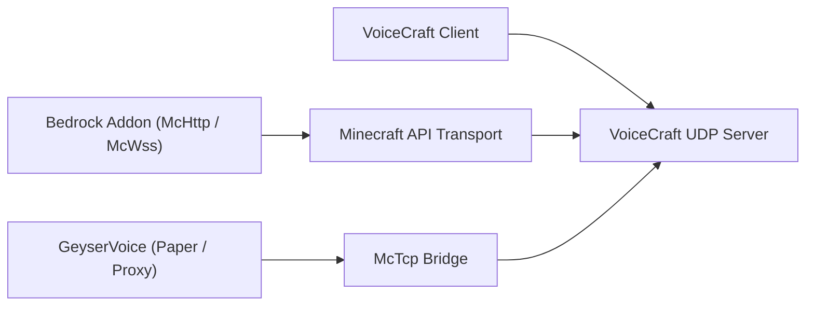

# VoiceCraft 生態系統

VoiceCraft 不僅僅是一種二進位程式。它是一個由倉庫和運行時層組成的小型生態系統，可以以不同的方式組合。

## 核心倉庫

1. `VoiceCraft`
   客戶端應用程式、獨立伺服器、協定、共享核心程式碼
2. `GeyserVoice`
   用於 Paper、Velocity 和 BungeeCord 的 Java 端橋
3. `VoiceCraft.Addon`
   Bedrock 外掛程式包和可編寫腳本的 McApi 介面

## 部署圖

## 典型堆疊

### 基岩專用伺服器

- `VoiceCraft.Server`
- `VoiceCraft.Addon.Core.McHttp`
- VoiceCraft 用戶端

### 本地基岩世界

- 本地 VoiceCraft 堆疊
- `VoiceCraft.Addon.Core.McWss`

### 帶有 Geyser / Floodgate 的 Java 伺服器

- `GeyserVoice`
- `VoiceCraft.Server`
- optionally a managed runtime started by `GeyserVoice` itself

### Java代理網絡

- `GeyserVoice` on proxy
- `GeyserVoice` on backend Paper servers
- `VoiceCraft.Server` reached through `McTcp`

## 為什麼存在多個倉庫

- `VoiceCraft` focuses on the core voice platform
- `GeyserVoice` translates Java or proxy environments into VoiceCraft-compatible state
- `VoiceCraft.Addon` exposes world automation, entity binding, and effect control on Bedrock

## 繼續

- [VoiceCraft 倉庫與建置](/zh_tw/ecosystem/voicecraft-repository)
- [GeyserVoice 概述](/zh_tw/ecosystem/geyservoice)
- [VoiceCraft.Addon 概述](/zh_tw/ecosystem/voicecraft-addon)
- [插件 API](/zh_tw/ecosystem/addon-api)
- [整合方案](/zh_tw/ecosystem/integration-recipes)
- [生產藍圖](/zh_tw/ecosystem/production-blueprints)
