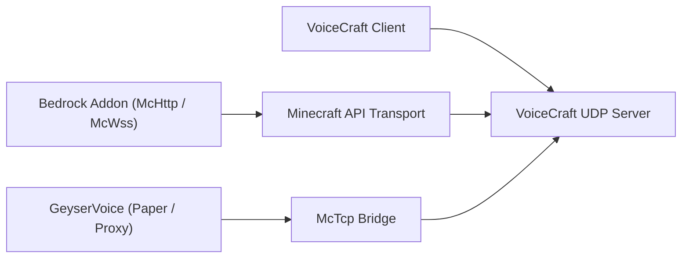

# VoiceCraft 生態系統

VoiceCraft 不僅僅是一種二進位。它是一個由儲存庫和運行時層組成的小型生態系統，可以以不同的方式組合。

主要想法很簡單：玩家執行 `VoiceCraft.Client`，一個後端運行或管理 `VoiceCraft.Server`，Minecraft 端整合將遊戲狀態傳送到伺服器。您選擇哪種整合取決於您的 Minecraft 運行時是 Bedrock、本地 Bedrock、直接 Paper 還是代理網路。

## 核心儲存庫

| 儲存庫 | 它擁有什麼 | 當 |
|------------|--------------|-------------|
| `VoiceCraft` | 客戶端應用程式、獨立伺服器、協定、共享核心程式碼、面向 Minecraft 的傳輸 | 您需要核心伺服器/客戶端運行時或想要從原始程式碼構建 |
| `GeyserVoice` | 用於 Paper、Velocity 和 BungeeCord 的 Java 端橋 | 您運行 Java、Geyser/Floodgate 或代理網絡 |
| `VoiceCraft.Addon` | Bedrock 外掛程式包和可編寫腳本的 McApi 介面 | 您運行基岩世界或想要自訂插件行為 |

## 部署圖

客戶端和 Minecraft 整合不透過同一路徑連接。客戶端使用 VoiceCraft UDP 端點。 Minecraft 整合使用 `McHttp`、`McWss` 或 `McTcp`。

## 典型堆疊

### 基岩專用伺服器

- `VoiceCraft.Server`
- `VoiceCraft.Addon.Core.McHttp`
- VoiceCraft 用戶端
- 插件所需的 BDS 腳本/模組權限

將此用於 BDS 可以到達 HTTP 端點的生產 Bedrock 伺服器。

### 當地基岩世界

- 本地 VoiceCraft 堆疊
- `VoiceCraft.Addon.Core.McWss`
- 本地 `/connect` websocket 流

使用它進行單人遊戲、演示和插件測試。

### 帶有 Geyser / Floodgate 的 Java 伺服器

- `GeyserVoice`
- `VoiceCraft.Server`
- 可選地，由 `GeyserVoice` 本身啟動的託管運行時
- `McTcp` 作為面向 VoiceCraft 的橋

當 Java 端伺服器狀態是玩家位置和綁定流的來源時使用此選項。

### Java代理網絡

- 代理程式上的 `GeyserVoice`
- 後端 Paper 伺服器上的 `GeyserVoice`
- 透過 `McTcp` 到達 `VoiceCraft.Server`
- 後端節點將快照串流傳輸到代理

當一個代理程式應該擁有多個後端伺服器的中央 VoiceCraft 連線時，請使用此選項。

## 為什麼存在多個儲存庫

- `VoiceCraft`專注於核心語音平台
- `GeyserVoice` 將 Java 或代理環境轉換為 VoiceCraft 相容狀態
- `VoiceCraft.Addon` 在基岩上公開世界自動化、實體綁定和效果控制

這種拆分讓每個專案都圍繞其執行時間發展：C# 用戶端/伺服器程式碼在 `VoiceCraft` 中，Java 插件程式碼在 `GeyserVoice` 中，基岩腳本/插件程式碼在 `VoiceCraft.Addon` 中。

## 選擇從哪裡開始

- 新基岩專用伺服器：
  從 [Quick Start](/start/quick-start) 開始，然後是 [McHttp for BDS](/minecraft/mchttp-bds)。
- 當地基岩測試：
  以 [McWss for Singleplayer Worlds](/minecraft/mcwss-singleplayer) 開頭。
- Java + Geyser/Floodgate：
  以 [GeyserVoice](/ecosystem/geyservoice) 開頭。
- 自訂基岩行為：
  讀取 [VoiceCraft.Addon](/ecosystem/voicecraft-addon)，然後讀取 [Addon API](/ecosystem/addon-api)。

## 繼續

- [VoiceCraft repository and build](/ecosystem/voicecraft-repository)
- [GeyserVoice overview](/ecosystem/geyservoice)
- [VoiceCraft.Addon overview](/ecosystem/voicecraft-addon)
- [Addon API](/ecosystem/addon-api)
- [Integration recipes](/ecosystem/integration-recipes)
- [Production blueprints](/ecosystem/production-blueprints)
